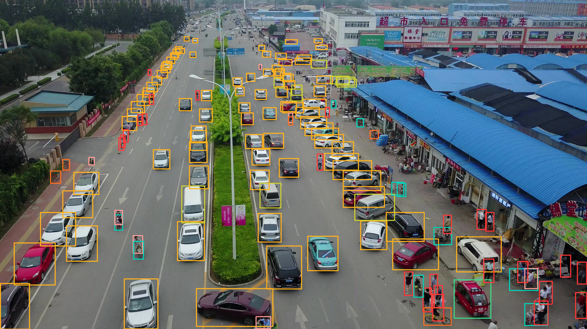
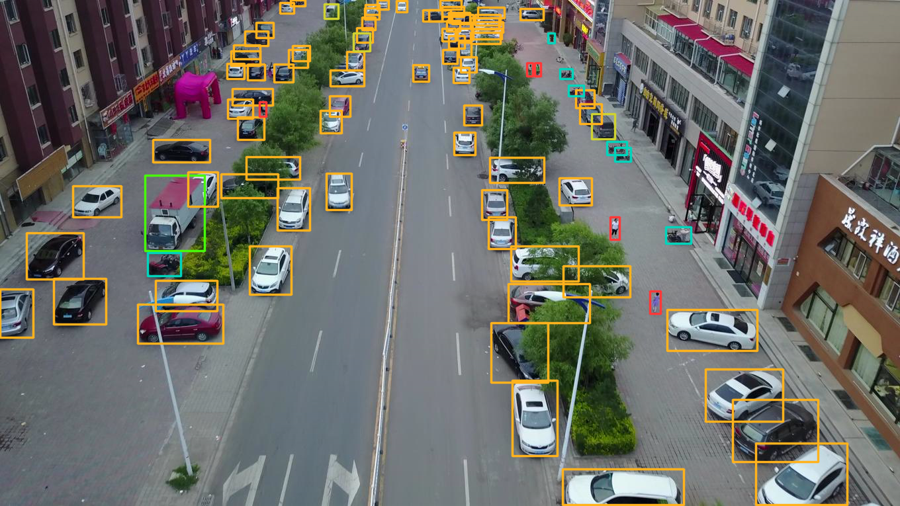
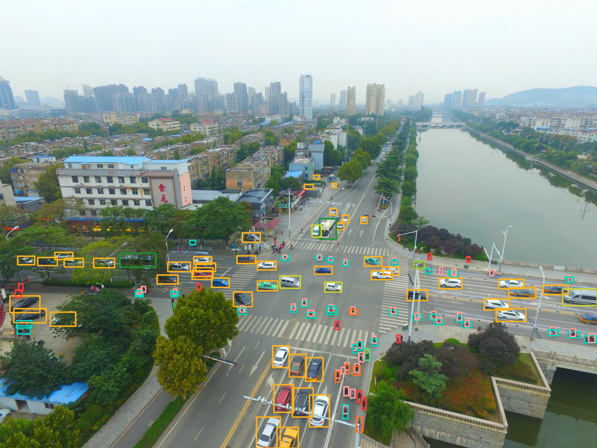

# NanoTrack: Real-time Small Object Detection & Tracking

Real-time small object detection and tracking on edge devices using EdgeYOLO-S, Norfair, ByteTrack and TensorRT.

This repository contains a fine-tuned EdgeYOLO-S model for small object tracking using VisDrone dataset, starting with **image and video inference** and now extended to **real-time camera and video object tracking**.  
The project is designed for edge devices (e.g., Jetson Orin NX, Xavier NX) and will evolve step by step into a full real-time detection + tracking system with a user interface.

## Demo Inference Images 
 
 


### Demo Video


---

## Current Features
- Fine-tuned **EdgeYOLO-S** model (VisDrone dataset)
- **Image inference**: object detection & classification with bounding box visualization
- **Video inference**: MP4 and other formats via the same `detect.py`
- **Real-time camera tracking**: USB / CSI cameras or custom GStreamer pipelines with `camera_tracking.py`
- Optional FP16 inference and configurable input size / thresholds
- Object tracking with **Norfair** (MOT benchmark-level tracker)
- Object tracking with **ByteTrack** (lightweight tracker)
- **User Interface (UI) with Click-to-Select tracking**

---

## Installation

This project requires [EdgeYOLO](https://github.com/edgeyolo/EdgeYOLO) and its dependencies.  
Please follow the official EdgeYOLO installation guide before running the code.

### 1. Clone EdgeYOLO
```bash
git clone https://github.com/edgeyolo/EdgeYOLO.git
cd EdgeYOLO
pip install -r requirements.txt
```
### 2. Swap detect.py
Swap the detect.py file provided in this repository with the detect.py file that is inside the edgeyolo folder. This is a customized inference script. 

### 3. Download the VisDrone fine-tuned EdgeYOLO-S model from the releases
Put it to the edgeyolo folder.

---

## Usage
Run the commands **inside the `EdgeYOLO` folder** after replacing `detect.py` and downloading the weights.

### A) Image Inference
```bash
python detect.py   --weights edgeyolo_visdrone.pth   --source detect_video_EdgeYOLO.mp4   --conf-thres 0.3   --nms-thres 0.5 \ 
  --input-size 640 640   --fp16   --batch 1 \ 
  --save-dir ./output 
```

### B) Video Inference
detect.py supports video when you pass a video file as --source. You can also enable multi-process decoding with --mp.
```bash
python detect.py   --weights edgeyolo_visdrone.pth   --source path/to/video.mp4   --conf-thres 0.3   --nms-thres 0.5   --input-size 640 640   --fp16   --batch 1   --mp   --save-dir ./output
```

### C) Video Tracking (Norfair / ByteTrack)
Run object detection + tracking on video files. Two trackers are supported: Norfair (MOT benchmark-level) and ByteTrack (lightweight).

**Norfair example:**
```bash
python3 video_tracking_norfair.py   --engine models/edgeyolo_s.engine   --meta models/edgeyolo.json   --video path/to/video.mp4   --conf-thres 0.3   --iou-thres 0.5   --save ./tracked_output_norfair.mp4   --render all
```

**ByteTrack example:**
```bash
python3 video_tracking_bytetrack.py   --engine models/edgeyolo_s.engine   --meta models/edgeyolo.json   --video path/to/video.mp4   --conf-thres 0.3   --iou-thres 0.5   --save ./tracked_output_bytetrack.mp4   --track-thres 0.6   --match-thres 0.8   --track-buffer 1000   --min-box-area 10   --render all
```

### D) Real-time Camera Inference (USB / CSI)
Use the provided **camera_tracking.py** script for live camera streams. Engine file must be used in this inference for optimization. Engine file can be created using the [ONNX model provided in Releases](https://github.com/ulassakin/realtime-edge-small-object-tracking/releases/download/v0.2/edgeyolo_s.onnx.zip).

```bash
python3 camera_tracking.py   --engine models/edgeyolo_s.engine   --meta models/edgeyolo.json   --gst "v4l2src device=/dev/video0 ! image/jpeg,width=1280,height=720,framerate=30/1 ! jpegdec ! videoconvert ! video/x-raw,format=BGR ! appsink drop=true sync=false"   --conf-thres 0.3   --iou-thres 0.5   --save ./output_gst.mp4
```

---

## User Interface (UI)

NanoTrack now includes a **User Interface (UI)** module located in the `NanoTrackUI/` folder.  
This interface provides a lightweight and interactive way to run detections, visualize results, and control tracking directly from a browser.

### Features
- **Live Visualization**: View detections and tracking results in real time (updated frames displayed via the UI).
- **Click-to-Select Tracking**: Click on any detected object in the video feed, and NanoTrack will begin tracking it immediately using ByteTrack or Norfair.
- **Tracker Controls**: Switch between **ByteTrack** and **Norfair** from the UI without modifying code.
- **Threshold Adjustment**: Change confidence or IOU thresholds dynamically from the UI.
- **Session Logging**: Save tracked outputs and metadata directly from the interface.

### How to Run the UI
The UI is a Flask + HTML/JS based interface.

1. Navigate to the UI folder:
```bash
cd NanoTrackUI
```

2. Install dependencies:
```bash
pip install -r requirements.txt
```

3. Run the app:
```bash
python app.py
```

4. Open your browser and go to:
```
http://localhost:5000
```

### Folder Structure
```
NanoTrackUI/
├── app.py              # Flask backend
├── templates/          # HTML templates
│   ├── index.html      # Main dashboard
│   └── results.html    # Results viewer
├── static/             # CSS, JS, images
│   ├── style.css
│   └── script.js
```

---


